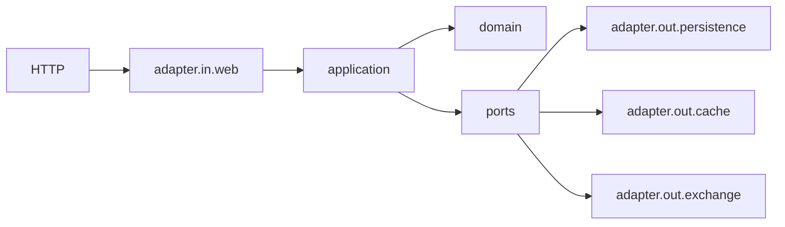

# Products API

API REST para gestionar productos y precios históricos mediante periodos de vigencia. El proyecto parte de los cuatro endpoints obligatorios del challenge Backend Java y añade multidivisa, conversión histórica, caché Redis y seguridad JWT.

La parte central de la solución no es el CRUD, sino la consistencia temporal ya que para un producto no puede haber dos precios vigentes el mismo día, tampoco cuando las escrituras llegan de forma concurrente. De tal modo que la aplicación ofrece una validación temprana para el caso normal y PostgreSQL conserva la garantía definitiva.

## Qué resuelve

- Crea productos y añade precios con una vigencia definida.
- Consulta el precio aplicable a una fecha o el historial completo del producto.
- Admite periodos cerrados y periodos sin fecha final.
- Impide solapamientos tanto en aplicación como en base de datos.
- Trabaja con `EUR`, `USD`, `GBP`, `JPY` y `CHF` y puede convertir un precio usando la tasa histórica de la fecha consultada.
- Protege la API con JWT RS256 y scopes de lectura y escritura.
- Cachea en Redis las dos lecturas más frecuentes sin convertirlo en fuente de verdad.
- Expone errores homogéneos, OpenAPI, Swagger UI y healthcheck.
- Incluye tests unitarios, de integración y E2E, además del benchmark del challenge y una prueba complementaria con k6.

La solución integrada está en `master`. Las ramas `feature/exchange-currency`, `feature/redis-cache`, `feature/jwt-security` y `feature/bonus-track` conservan la evolución incremental de los bonus.

## Stack

- Java 21 y Spring Boot 3.5.15.
- Spring Web, Bean Validation y Spring Data JPA.
- Spring Security OAuth2 Resource Server.
- PostgreSQL 17 y Flyway.
- Redis 7.4.
- Spring Boot Actuator y SpringDoc OpenAPI 2.8.17.
- Maven Wrapper, JUnit 5, Mockito y Testcontainers.
- Docker y Docker Compose v2.
- Bash y `curl` para el benchmark; Grafana k6 1.7.1 para la carga complementaria.

## Inicio rápido

### Requisitos

- Docker con el daemon en ejecución.
- Docker Compose v2 (`docker compose`).
- Java 21 para generar las claves y tokens JWT locales.
- Puertos `8080`, `5432` y `6379` disponibles.

No hace falta instalar PostgreSQL, Redis ni Maven en el host.

### Arranque desde cero para el técnico que evalúa el challenge

Esta es la ruta mínima para evaluar la entrega: prepara la seguridad local, construye la aplicación, comprueba que está saludable, ejecuta un flujo funcional y lanza las suites de tests.

#### 1. Clonar y comprobar el entorno

```bash
git clone https://github.com/apiscog/products-mango.git
cd products-mango

docker --version
docker compose version
java -version
```

La salida debe confirmar Docker, Compose v2 y Java 21. Si Docker está instalado pero los siguientes pasos no pueden crear contenedores, comprueba que el daemon o Docker Desktop estén en ejecución.

#### 2. Generar las claves JWT de desarrollo

```bash
java tools/jwt/GenerateDevKeys.java
```

La API está protegida y necesita una clave pública para arrancar. Este comando genera un par RSA exclusivo para el clon actual:

```text
tools/jwt/generated/dev-private-key.pem       # firma tokens; permanece en el host
config/jwt/generated/dev-public-key.pem       # se monta en la API en modo lectura
```

Las claves están ignoradas por Git. Si ya existen, la herramienta las conserva; no las reemplaza de forma silenciosa.

#### 3. Construir y levantar la aplicación

```bash
docker compose up -d --build postgres redis app
```

La primera ejecución puede tardar mientras Docker descarga las imágenes y Maven resuelve dependencias durante el build. Después ocurre lo siguiente:

1. PostgreSQL y Redis arrancan y deben superar sus healthchecks.
2. Compose inicia la API cuando ambas dependencias están saludables.
3. Flyway aplica las migraciones y crea el esquema de PostgreSQL.
4. Hibernate valida el esquema, pero no crea ni modifica tablas.
5. Spring Boot carga la clave pública JWT y expone la API en el puerto `8080`.

#### 4. Comprobar que todo está preparado

En Bash:

```bash
docker compose ps
curl -fsS http://localhost:8080/actuator/health
```

En PowerShell:

```powershell
docker compose ps
Invoke-RestMethod http://localhost:8080/actuator/health
```

`docker compose ps` debe mostrar `postgres`, `redis` y `app` en ejecución y saludables. El healthcheck debe responder:

```json
{"status":"UP"}
```

Si la API no queda saludable, revisa primero sus logs:

```bash
docker compose logs --tail=200 app
```

Los fallos de arranque más habituales son una clave pública todavía no generada, algún puerto ocupado o Docker sin recursos suficientes.

| Servicio | Dirección |
|---|---|
| API | <http://localhost:8080> |
| Healthcheck | <http://localhost:8080/actuator/health> |
| Swagger UI | <http://localhost:8080/swagger-ui/index.html> |
| OpenAPI JSON | <http://localhost:8080/v3/api-docs> |
| PostgreSQL | `localhost:5432` |
| Redis | `localhost:6379` |

#### 5. Generar credenciales para probar la API

La utilidad local emite tokens de unos 15 minutos. `writer` incluye los scopes `products.read products.write` y `reader` solo incluye `products.read`.

Linux o macOS:

```bash
writer_token="$(java tools/jwt/GenerateToken.java writer)"
reader_token="$(java tools/jwt/GenerateToken.java reader)"
```

PowerShell:

```powershell
$writerToken = java tools/jwt/GenerateToken.java writer
$readerToken = java tools/jwt/GenerateToken.java reader
```

Para una revisión manual, abre Swagger UI, pulsa **Authorize** y pega el JWT sin escribir `Bearer`: <http://localhost:8080/swagger-ui/index.html>.

#### 6. Ejecutar un smoke test

El flujo mínimo consiste en crear un producto, asociarle un periodo de precio y consultar qué precio aplica en una fecha. Los ejemplos siguientes usan Bash; copia el `id` devuelto por la primera petición en `product_id`.

Crear el producto:

```bash
curl -i -X POST http://localhost:8080/products \
  -H "Authorization: Bearer $writer_token" \
  -H 'Content-Type: application/json' \
  -d '{
    "name": "Zapatillas deportivas",
    "description": "Modelo 2025 edición limitada"
  }'
```

La respuesta esperada es `201 Created`, una cabecera `Location: /products/{id}` y un cuerpo con el identificador. Utiliza ese valor en los comandos siguientes:

```bash
product_id=1 # sustituir por el id devuelto
```

Añadir un precio válido del 1 de enero al 30 de junio de 2024:

```bash
curl -i -X POST "http://localhost:8080/products/$product_id/prices" \
  -H "Authorization: Bearer $writer_token" \
  -H 'Content-Type: application/json' \
  -d '{
    "value": 99.99,
    "currency": "EUR",
    "initDate": "2024-01-01",
    "endDate": "2024-06-30"
  }'
```

La API debe responder `201 Created`. Ahora consulta una fecha dentro del periodo:

```bash
curl -fsS \
  -H "Authorization: Bearer $reader_token" \
  "http://localhost:8080/products/$product_id/prices?date=2024-04-15"
```

```json
{"value":99.99,"currency":"EUR"}
```

Por último, comprueba el historial completo:

```bash
curl -fsS \
  -H "Authorization: Bearer $reader_token" \
  "http://localhost:8080/products/$product_id/prices"
```

#### 7. Ejecutar las pruebas

Para obtener feedback rápido sin levantar infraestructura de test:

```bash
./mvnw test
```

```powershell
.\mvnw.cmd test
```

Esta suite ejecuta 124 tests de dominio, aplicación, web, seguridad y adaptadores aislados.

Para la validación completa, mantén Docker activo y ejecuta:

```bash
./mvnw verify
```

```powershell
.\mvnw.cmd verify
```

`verify` añade 55 ejecuciones `*IT` con PostgreSQL y Redis reales mediante Testcontainers. Incluye migraciones Flyway, restricción de solapamiento, concurrencia, caché, JWT y peticiones HTTP end-to-end. No es necesario detener los servicios de Compose: Testcontainers utiliza sus propios contenedores y puertos.

#### 8. Detener y limpiar

Para detener los servicios conservando los datos:

```bash
docker compose down
```

Para eliminar también el volumen de PostgreSQL:

```bash
docker compose down -v
```

## Arquitectura

El proyecto usa una arquitectura hexagonal ligera dentro de una única aplicación. El recorrido de una petición es:



El diagrama representa el flujo en ejecución. En código, los adaptadores de salida implementan puertos definidos hacia dentro: la infraestructura depende del contrato de aplicación, no al revés.

- `domain` contiene el modelo y las invariantes en Java puro; no depende de Spring, JPA ni HTTP.
- `application` contiene casos de uso, comandos, resultados y puertos. Coordina el dominio y decide cuándo consultar persistencia o conversión.
- `adapter.in.web` traduce HTTP a comandos de aplicación y devuelve DTO de respuesta. Los DTO HTTP no atraviesan hacia aplicación o dominio.
- `adapter.out.persistence` implementa los puertos con JPA y PostgreSQL. Las entidades JPA se mapean y no salen del adaptador.
- `adapter.out.cache` y `adapter.out.exchange` encapsulan Redis y los proveedores HTTP de tipos de cambio.

La separación busca que las reglas importantes se prueben sin infraestructura y que cambiar un detalle externo no obligue a contaminar el dominio. Es deliberadamente ligera: no se añaden capas o interfaces sin una responsabilidad concreta.

## Modelo temporal

Cada precio tiene una fecha inicial obligatoria y una fecha final opcional:

- `initDate` es inclusiva.
- `endDate` también es inclusiva.
- `endDate: null` representa una vigencia abierta.
- En un intervalo cerrado debe cumplirse `initDate < endDate`.
- Puede haber huecos entre periodos.
- Dos precios del mismo producto no pueden estar vigentes el mismo día, aunque usen monedas distintas.

Por ejemplo, `[2024-01-01, 2024-06-30]` se solapa con `[2024-06-30, 2024-12-31]`, porque ambos incluyen el 30 de junio. El segundo periodo tendría que empezar el `2024-07-01` para no solaparse.

Se usa `LocalDate` porque la regla opera sobre días completos, no sobre instantes. Introducir hora o zona horaria añadiría ambigüedad sin aportar información al dominio.

### Cómo se representa en PostgreSQL

La API ofrece intervalos inclusivos, mientras que PostgreSQL trabaja especialmente bien con rangos semiabiertos. Flyway crea una columna generada `DATERANGE` llamada `validity`:

- un periodo cerrado se almacena conceptualmente como `[initDate, endDate + 1)`;
- un periodo sin fin se representa como `[initDate, infinity)`.

Así se conserva la semántica inclusiva de la API y las consultas pueden usar operadores nativos de rango tanto para localizar un precio (`@>`) como para detectar solapamientos (`&&`).

## API

Las fechas usan el formato ISO `yyyy-MM-dd`. Los cuatro endpoints del challenge son:

| Método | Ruta | Resultado |
|---|---|---|
| `POST` | `/products` | Crea un producto; `201 Created` |
| `POST` | `/products/{id}/prices` | Añade un periodo de precio; `201 Created` |
| `GET` | `/products/{id}/prices?date=YYYY-MM-DD` | Devuelve el precio vigente; `200 OK` |
| `GET` | `/products/{id}/prices` | Devuelve el historial ordenado; `200 OK` |

Los ejemplos siguientes usan las variables Bash generadas en el inicio rápido.

### Crear un producto

```bash
curl -i -X POST http://localhost:8080/products \
  -H "Authorization: Bearer $writer_token" \
  -H 'Content-Type: application/json' \
  -d '{
    "name": "Zapatillas deportivas",
    "description": "Modelo 2025 edición limitada"
  }'
```

```json
{
  "id": 1,
  "name": "Zapatillas deportivas",
  "description": "Modelo 2025 edición limitada"
}
```

### Añadir precios

Si no se envía `currency`, el valor predeterminado es `EUR`.

```bash
curl -i -X POST http://localhost:8080/products/1/prices \
  -H "Authorization: Bearer $writer_token" \
  -H 'Content-Type: application/json' \
  -d '{
    "value": 99.99,
    "initDate": "2024-01-01",
    "endDate": "2024-06-30"
  }'
```

```json
{
  "value": 99.99,
  "currency": "EUR",
  "initDate": "2024-01-01",
  "endDate": "2024-06-30"
}
```

Un periodo abierto usa `endDate: null`:

```bash
curl -i -X POST http://localhost:8080/products/1/prices \
  -H "Authorization: Bearer $writer_token" \
  -H 'Content-Type: application/json' \
  -d '{
    "value": 129.99,
    "currency": "EUR",
    "initDate": "2024-07-01",
    "endDate": null
  }'
```

### Consultar el precio vigente

```bash
curl \
  -H "Authorization: Bearer $reader_token" \
  'http://localhost:8080/products/1/prices?date=2024-04-15'
```

```json
{
  "value": 99.99,
  "currency": "EUR"
}
```

### Consultar el historial

```bash
curl \
  -H "Authorization: Bearer $reader_token" \
  http://localhost:8080/products/1/prices
```

```json
{
  "name": "Zapatillas deportivas",
  "description": "Modelo 2025 edición limitada",
  "prices": [
    {
      "value": 99.99,
      "currency": "EUR",
      "initDate": "2024-01-01",
      "endDate": "2024-06-30"
    },
    {
      "value": 129.99,
      "currency": "EUR",
      "initDate": "2024-07-01",
      "endDate": null
    }
  ]
}
```

Un producto existente sin precios devuelve el mismo contrato con `"prices": []`.

### Manejo de errores

Los errores controlados comparten una estructura estable:

```json
{
  "timestamp": "2026-07-18T12:00:00Z",
  "status": 409,
  "code": "PRICE_OVERLAP",
  "message": "The price period overlaps an existing price",
  "path": "/products/1/prices",
  "violations": []
}
```

| HTTP | Código | Significado |
|---:|---|---|
| 400 | `VALIDATION_ERROR` | Parámetros o reglas de dominio inválidos |
| 400 | `MALFORMED_REQUEST` | JSON ausente, inválido o con tipos incorrectos |
| 401 | `UNAUTHORIZED` | Token ausente o inválido |
| 403 | `FORBIDDEN` | Token válido sin el scope requerido |
| 404 | `PRODUCT_NOT_FOUND` | El producto no existe |
| 404 | `PRICE_NOT_FOUND` | No existe un precio vigente en esa fecha |
| 409 | `PRICE_OVERLAP` | El periodo se solapa con otro precio |
| 503 | `SERVICE_UNAVAILABLE` | No se pudo obtener una tasa histórica válida |
| 500 | `INTERNAL_ERROR` | Error no controlado |

Las violaciones de Bean Validation añaden `field` y `message` en `violations`. Las respuestas no exponen tokens, claves, stack traces, SQL, URLs externas ni cuerpos devueltos por proveedores.

## Seguridad JWT

### Modelo de seguridad

La API funciona como OAuth2 Resource Server stateless. Acepta Bearer tokens firmados con RS256, valida firma, expiración, `issuer` y `audience`, y convierte el claim `scope` en authorities de Spring Security. No emite tokens, no mantiene sesiones, no gestiona usuarios y no implementa un Authorization Server.

| Acceso | Regla |
|---|---|
| Público | Healthcheck, OpenAPI y Swagger UI |
| Lectura | `products.read` para `GET /products/**` |
| Escritura | `products.write` para `POST /products/**` |

La traducción de scopes es directa:

```text
products.read  -> SCOPE_products.read
products.write -> SCOPE_products.write
```

El token `writer` de desarrollo incluye ambos scopes. Esto es explícito: disponer de `products.write` no concede lectura por implicación.

### Generar las claves locales

Desde la raíz del repositorio:

```bash
java tools/jwt/GenerateDevKeys.java
```

La utilidad crea:

```text
tools/jwt/generated/dev-private-key.pem
config/jwt/generated/dev-public-key.pem
```

La clave privada solo la usa `GenerateToken.java`; está ignorada por Git y no se monta en la API. Compose monta únicamente la clave pública en modo lectura.

Si existe solo una de las dos claves, la herramienta falla para no dejar un par inconsistente. Para sustituir deliberadamente ambas:

```bash
java tools/jwt/GenerateDevKeys.java --force
```

Los tokens firmados con el par anterior dejarán de ser válidos.

### Generar y usar tokens

```bash
writer_token="$(java tools/jwt/GenerateToken.java writer)"
reader_token="$(java tools/jwt/GenerateToken.java reader)"
```

```powershell
$writerToken = java tools/jwt/GenerateToken.java writer
$readerToken = java tools/jwt/GenerateToken.java reader
$writerToken | Set-Clipboard
```

Los valores de desarrollo son:

| Variable | Valor predeterminado |
|---|---|
| `JWT_ISSUER` | `products-challenge-dev` |
| `JWT_AUDIENCE` | `products-api` |
| `JWT_PUBLIC_KEY_LOCATION` | `file:./config/jwt/generated/dev-public-key.pem` |
| `JWT_PRIVATE_KEY_LOCATION` | `tools/jwt/generated/dev-private-key.pem` |
| `JWT_TOKEN_TTL_SECONDS` | `900` (aproximadamente 15 minutos) |

En producción, la API seguiría validando tokens, pero la emisión se delegaría en un proveedor de identidad. La clave pública se montaría como secret y la privada nunca formaría parte del contenedor de la API.

Resultados y casos probados: [docs/jwt-security-results.md](docs/jwt-security-results.md).

## Bonus

### Multidivisa

Cada precio conserva el importe y la moneda originales. Se admiten `EUR`, `USD`, `GBP`, `JPY` y `CHF`; los códigos se aceptan sin distinguir mayúsculas y minúsculas y se normalizan a mayúsculas antes de persistirlos. Si `currency` se omite o llega como `null`, se usa `EUR` para mantener compatible el contrato inicial.

Los importes usan `BigDecimal` y PostgreSQL `NUMERIC(19,2)`. La API rechaza valores no positivos o con más de dos decimales, en vez de aplicar un redondeo silencioso al guardar.

Flyway V2 añadió `prices.currency`, migró a `EUR` los registros existentes y aplicó la restricción de monedas soportadas. La moneda no modifica la regla temporal: no se admiten dos precios simultáneos para el mismo producto aunque estén expresados en monedas distintas.

### Conversión histórica

La conversión es opcional y solo existe al consultar un precio vigente; el historial siempre devuelve valores persistidos, sin convertirlos.

```bash
curl \
  -H "Authorization: Bearer $reader_token" \
  'http://localhost:8080/products/1/prices?date=2024-04-15&currency=USD'
```

```json
{
  "value": 106.74,
  "currency": "USD",
  "originalValue": 99.99,
  "originalCurrency": "EUR",
  "exchangeRate": 1.0675,
  "exchangeRateDate": "2024-04-15"
}
```

`ExchangeRateProvider` mantiene el caso de uso independiente del proveedor HTTP. El adaptador consulta primero jsDelivr sobre `@fawazahmed0/currency-api` y usa `currency-api.pages.dev` como fallback cuando hay timeout, error de red, respuesta 5xx, histórico no encontrado (`404`) o contenido inválido. Otros errores 4xx del proveedor principal se consideran no recuperables y no disparan el fallback.

Aceptar cualquier respuesta exitosa sería peligroso para una conversión histórica, por lo que la fecha devuelta debe coincidir exactamente con la solicitada. Los timeouts predeterminados son 2 segundos para conexión y 3 para lectura. Se configuran mediante:

- `EXCHANGE_API_PRIMARY_URL` y `EXCHANGE_API_FALLBACK_URL`; ambas plantillas deben contener `{date}` y `{base}`.
- `EXCHANGE_API_CONNECT_TIMEOUT` y `EXCHANGE_API_READ_TIMEOUT`.

La tasa se mantiene como `BigDecimal` y no se redondea. Solo el importe final se lleva a dos decimales con `RoundingMode.HALF_UP`; como simplificación del challenge, esto también se aplica a JPY. La conversión se calcula en lectura, no se persiste ni altera el historial.

Si origen y destino coinciden, la tasa es `1` y no se llama a ningún proveedor. Si el fallo principal no es recuperable, o si también falla el fallback, la API responde `503 SERVICE_UNAVAILABLE` sin filtrar detalles externos.

Más contexto: [docs/exchange-currency-results.md](docs/exchange-currency-results.md) y [docs/bonus-track-results.md](docs/bonus-track-results.md).

### Redis

PostgreSQL sigue siendo la fuente de verdad. Redis solo cachea resultados correctos de estas lecturas:

| Caché | Clave completa | TTL predeterminado |
|---|---|---:|
| Precio vigente original | `products::current-price::<productId>::v<version>::<date>` | 5 minutos (`CURRENT_PRICE_CACHE_TTL`) |
| Historial | `products::price-history::<productId>::v<version>` | 2 minutos (`PRICE_HISTORY_CACHE_TTL`) |

Los valores se serializan como JSON. La consulta convertida reutiliza el precio original cacheado y calcula la conversión después; ni las tasas ni el resultado convertido se guardan en Redis.

Al añadir un precio correctamente se incrementa `products::cache-version::<productId>`. Las nuevas lecturas usan otra versión de clave, de modo que las entradas anteriores dejan de ser accesibles y expiran por TTL. Este versionado invalida solo el producto modificado y evita barridos con `KEYS` o `SCAN`; el contador de versión no tiene expiración configurada.

La caché trabaja en modo fail-open. Si Redis falla durante una lectura, escritura o invalidación, se registra el contador `products.cache.errors` y la petición continúa contra PostgreSQL. Esto mantiene disponible el negocio ante una caída posterior de Redis, aunque Compose exige que Redis esté saludable para arrancar inicialmente. Una invalidación fallida puede dejar una ventana de datos obsoletos si Redis se recupera antes de que expire el TTL; es el compromiso asumido para no introducir transacciones distribuidas.

Detalles y mediciones: [docs/redis-cache-results.md](docs/redis-cache-results.md).

## Persistencia y concurrencia

### Validación previa

Antes de insertar un precio, el caso de uso comprueba que el producto exista y ejecuta una consulta `EXISTS` sobre `validity && daterange(...)`. En el flujo habitual esto evita intentar una escritura inválida y permite devolver una respuesta de negocio clara:

```text
409 PRICE_OVERLAP
```

Esta comprobación es útil, pero no es una garantía de concurrencia. Dos transacciones pueden leer al mismo tiempo, concluir que no existe solapamiento e intentar insertar ambos periodos.

### Garantía definitiva en PostgreSQL

Flyway habilita `btree_gist` y define una restricción `EXCLUDE USING gist` que combina:

- `product_id WITH =`;
- `validity WITH &&`.

PostgreSQL es quien serializa finalmente esa invariante. Si dos escrituras concurrentes superan la consulta previa, una de ellas será rechazada por `ex_prices_product_validity` con SQLSTATE `23P01`. El adaptador reconoce conjuntamente el SQLSTATE y el nombre de la restricción, y lo traduce a `PriceOverlapException`; la capa web devuelve el mismo `409 PRICE_OVERLAP` sin exponer SQL.

Elegí PostgreSQL frente a una base embebida porque el comportamiento crítico depende de `DATERANGE`, GiST y `EXCLUDE`. Simularlo con validaciones Java o probar solo contra H2 dejaría sin cubrir precisamente la carrera que la solución intenta evitar.

Las entidades también son deliberadamente simples. `Product` no contiene una colección navegable de precios y `PriceJpaEntity` guarda `productId` como escalar. Las consultas expresan exactamente qué necesitan, evitan cargar historiales por accidente y reducen el riesgo de N+1 o de acoplar el dominio al grafo JPA.

## Tests

### Suite rápida

Linux o macOS:

```bash
./mvnw test
```

Windows:

```powershell
.\mvnw.cmd test
```

Surefire ejecuta `*Test`: dominio, casos de uso, validaciones, WebMvc, seguridad, caché, proveedor de cambio y utilidades JWT. No levanta PostgreSQL, Redis, Compose ni la aplicación completa, por lo que sirve como feedback rápido.

Total actual: **124 tests**.

### Integración y E2E

Linux o macOS:

```bash
./mvnw verify
```

Windows:

```powershell
.\mvnw.cmd verify
```

`verify` vuelve a ejecutar la suite rápida y Failsafe añade `*IT`. Requiere Docker activo porque Testcontainers levanta PostgreSQL y Redis reales. La suite cubre migraciones Flyway, persistencia, restricción `EXCLUDE`, carreras concurrentes, caché, fail-open, JWT real y peticiones HTTP end-to-end.

Total actual: **55 ejecuciones de integración** y **179 ejecuciones en conjunto**.

No se usa H2. Las invariantes más importantes dependen de comportamiento específico de PostgreSQL, y sustituirlo en integración daría una falsa sensación de seguridad. Testcontainers mantiene el aislamiento sin renunciar al motor que ejecutará la aplicación.

## Rendimiento

El repositorio conserva dos herramientas con metodologías distintas. Sus resultados no son directamente comparables.

### Benchmark oficial del challenge

`performance/benchmark.sh` conserva el escenario del challenge:

1. Espera el healthcheck.
2. Crea un producto y tres precios de referencia.
3. Comprueba tres fechas y el historial.
4. Lanza 1.000 altas de producto.
5. Lanza 20.000 consultas de precio vigente.
6. Lanza 15.000 consultas de historial.

Usa procesos `curl` en background y mide el tiempo de cada bloque. No modela VUs, no define thresholds y no calcula percentiles. La versión presente en esta rama añade la cabecera JWT necesaria para ejecutar el escenario contra la API protegida, por lo que exige un token `writer`:

```bash
export ACCESS_TOKEN="$(java tools/jwt/GenerateToken.java writer)"
bash performance/run-benchmark.sh
```

El script usa la URL fija `http://product-api:8080`. Por tanto, debe ejecutarse desde un entorno donde ese nombre resuelva al contenedor de la API; no debe asumirse que el DNS interno de Compose estará disponible desde cualquier shell del host.

Los resultados históricos y las condiciones de medida están en [docs/performance-results.md](docs/performance-results.md). Deben leerse como resultados del escenario y commit allí indicados, no como percentiles de k6 ni como una medida automáticamente reproducible sobre cualquier hardware.

### Prueba complementaria con k6

`performance/products-load-test.js` reproduce las cantidades principales, pero usa `shared-iterations` para controlar la concurrencia y añade validación del contrato, checks, thresholds y estadísticas `p50`, `p95` y `p99`. Los VUs cambian la concurrencia, no el número total de iteraciones.

Linux o macOS:

```bash
export ACCESS_TOKEN="$(java tools/jwt/GenerateToken.java writer)"

docker compose --profile benchmark up \
  --build \
  --abort-on-container-exit \
  --exit-code-from k6
```

PowerShell:

```powershell
$env:ACCESS_TOKEN = java tools/jwt/GenerateToken.java writer

docker compose --profile benchmark up `
  --build `
  --abort-on-container-exit `
  --exit-code-from k6
```

| Variable | Valor predeterminado |
|---|---:|
| `BASE_URL` | `http://app:8080` |
| `PRODUCT_CREATION_VUS` | `100` |
| `PRICE_QUERY_VUS` | `500` |
| `HISTORY_QUERY_VUS` | `500` |

k6 ejecuta las fases por separado: setup funcional, creación, consulta de precio e historial. Esta instrumentación aporta observabilidad bajo concurrencia controlada, pero no convierte sus cifras en equivalentes a los tiempos del benchmark Bash.

## Decisiones técnicas

- **Java 21 y Spring Boot 3.5.** Java 21 aporta una base LTS y Spring Boot integra un ecosistema maduro para web, validación, seguridad y OpenAPI sin desplazar las reglas al framework.
- **Arquitectura hexagonal ligera.** La separación protege el dominio y hace rápidos los tests de negocio; se evita multiplicar interfaces cuando no hay un límite real que aislar.
- **PostgreSQL y Flyway.** PostgreSQL resuelve la invariante concurrente con tipos y restricciones nativas. Flyway versiona ese esquema y `ddl-auto=validate` impide que Hibernate lo modifique implícitamente.
- **`BigDecimal`.** Los importes y tasas no deben heredar errores binarios de `double`. El precio persistido exige dos decimales como máximo y la conversión solo redondea el resultado final.
- **`LocalDate`.** La vigencia se define por días inclusivos, sin hora ni zona; un tipo temporal más preciso introduciría estados que el negocio no usa.
- **JPA sin relaciones navegables.** Los identificadores y consultas explícitas mantienen predecible cada acceso y evitan cargas accidentales de historiales.
- **Testcontainers.** Probar PostgreSQL, Flyway y Redis reales cuesta más que una base embebida, pero valida las garantías que justifican la solución.
- **Redis como optimización, no como verdad.** La caché descarga lecturas repetidas y falla abierta; PostgreSQL conserva los datos y el contrato sigue funcionando sin Redis tras el arranque.
- **Proveedor principal y fallback.** Un puerto aísla el caso de uso, mientras el adaptador aplica timeouts, valida fecha y contenido y prueba una segunda fuente solo ante fallos recuperables.
- **Dos pruebas de rendimiento.** El benchmark preserva el escenario solicitado; k6 añade control de concurrencia y percentiles. Mantenerlos separados evita presentar métricas distintas como si midieran lo mismo.
- **Optimización basada en medidas.** No se ajustan pools, JVM o índices sin una necesidad observada; los índices existentes responden al modelo de consulta y Redis se acompaña de resultados reproducibles.

## Estructura del proyecto

```text
src/main/java/com/mango/products
├── domain
│   └── Modelo e invariantes de negocio
├── application
│   ├── Casos de uso, comandos, resultados y puertos
│   └── Decoradores de caché
└── adapter
    ├── in/web
    │   └── REST, DTO, validación, errores, seguridad y OpenAPI
    └── out
        ├── persistence
        │   └── JPA, mappers, repositorios y PostgreSQL
        ├── cache
        │   └── Redis
        └── exchange
            └── Proveedores de cambio de divisa

src/main/resources/db/migration
└── Migraciones Flyway

src/test
└── Tests unitarios, integración y end-to-end

tools/jwt
└── Generación local de claves y tokens

performance
├── benchmark.sh
├── run-benchmark.sh
├── products-load-test.js
└── run-k6-load-test.sh

docs
└── Resultados y decisiones técnicas de cada incremento
```

## Ejecución local con Maven

Para ejecutar la API fuera de Docker se necesitan Java 21, PostgreSQL 17, Redis y la clave pública JWT. Una forma práctica es dejar solo la infraestructura en Compose:

```bash
java tools/jwt/GenerateDevKeys.java
docker compose up -d postgres redis
./mvnw spring-boot:run
```

En Windows, el último comando es:

```powershell
.\mvnw.cmd spring-boot:run
```

| Variable | Valor local predeterminado |
|---|---|
| `SPRING_DATASOURCE_URL` | `jdbc:postgresql://localhost:5432/products` |
| `SPRING_DATASOURCE_USERNAME` | `products` |
| `SPRING_DATASOURCE_PASSWORD` | `products` |
| `SPRING_DATA_REDIS_HOST` | `localhost` |
| `SPRING_DATA_REDIS_PORT` | `6379` |
| `JWT_PUBLIC_KEY_LOCATION` | `file:./config/jwt/generated/dev-public-key.pem` |
| `JWT_ISSUER` | `products-challenge-dev` |
| `JWT_AUDIENCE` | `products-api` |

Flyway se ejecuta también en este modo. Para revisar el challenge, Compose completo sigue siendo el camino más reproducible porque fija las versiones y healthchecks de la infraestructura.

## Limitaciones y posibles mejoras

El alcance actual no incluye:

- Gestión de usuarios.
- Emisión, refresh o revocación inmediata de tokens.
- Paginación.
- Actualización o eliminación de precios.
- Conversión del historial.
- Criptomonedas.
- Reglas de decimales específicas por divisa.
- Un SLA sobre el proveedor gratuito de cambio.

En una evolución tendría sentido valorar un IdP real y rotación de claves, paginación del historial, caché de tasas, observabilidad y alertas, CI/CD y despliegue cloud. Un API Gateway solo tendría sentido si el sistema creciera hacia varios servicios. Son posibles líneas de trabajo, no funcionalidades implementadas.

## Comandos útiles

| Objetivo | Comando |
|---|---|
| Generar claves JWT | `java tools/jwt/GenerateDevKeys.java` |
| Regenerar las dos claves | `java tools/jwt/GenerateDevKeys.java --force` |
| Generar token reader | `java tools/jwt/GenerateToken.java reader` |
| Generar token writer | `java tools/jwt/GenerateToken.java writer` |
| Levantar API, PostgreSQL y Redis | `docker compose up -d --build postgres redis app` |
| Ver estado | `docker compose ps` |
| Ver logs de la API | `docker compose logs app` |
| Detener conservando datos | `docker compose down` |
| Detener y borrar datos | `docker compose down -v` |
| Tests rápidos en Linux/macOS | `./mvnw test` |
| Tests rápidos en Windows | `.\mvnw.cmd test` |
| Suite completa en Linux/macOS | `./mvnw verify` |
| Suite completa en Windows | `.\mvnw.cmd verify` |
| Benchmark del challenge | `bash performance/run-benchmark.sh` |
| Carga k6 | `docker compose --profile benchmark up --build --abort-on-container-exit --exit-code-from k6` |

Documentación complementaria:

- [docs/bonus-track-results.md](docs/bonus-track-results.md)
- [docs/exchange-currency-results.md](docs/exchange-currency-results.md)
- [docs/jwt-security-results.md](docs/jwt-security-results.md)
- [docs/performance-results.md](docs/performance-results.md)
- [docs/redis-cache-results.md](docs/redis-cache-results.md)
