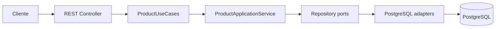

# Products API

API REST para gestionar productos y precios con vigencia temporal. La solución conserva los cuatro
endpoints obligatorios del reto y prioriza reglas de negocio explícitas, consistencia bajo concurrencia,
consultas acotadas y una ejecución reproducible con PostgreSQL.

## Funcionalidades

- Crear productos.
- Añadir periodos de precio a un producto.
- Consultar el precio vigente en una fecha.
- Consultar el historial completo, ordenado por fecha inicial.
- Validar el contrato HTTP y devolver errores uniformes.
- Impedir solapamientos incluso ante escrituras concurrentes.
- Exponer OpenAPI, Swagger UI y un healthcheck.
- Ejecutar tests rápidos, tests PostgreSQL/end-to-end y un benchmark k6 reproducible.

### Semántica temporal

- `initDate` es obligatoria e inclusiva.
- `endDate` es opcional e inclusiva; `null` significa vigencia indefinida.
- En un intervalo finito debe cumplirse `initDate < endDate`.
- Se permiten huecos entre precios.
- Dos periodos que comparten una fecha se solapan.

Por ejemplo, `[2024-01-01, 2024-06-30]` se solapa con
`[2024-06-30, 2024-12-31]`, pero no con `[2024-07-01, 2024-12-31]`.

## Stack tecnológico

- Java 21.
- Spring Boot 3.5.15.
- Spring Web, Bean Validation, Spring Data JPA y Actuator.
- PostgreSQL 17 y Flyway.
- SpringDoc OpenAPI 2.8.17.
- Maven Wrapper.
- JUnit 5, Mockito y Testcontainers.
- Docker y Docker Compose.
- Grafana k6 1.7.1.

## Arquitectura

Se aplica una arquitectura hexagonal ligera dentro de una única aplicación modular:



- `domain` contiene Java puro y no depende de Spring, JPA ni HTTP.
- `application` define casos de uso, comandos, resultados y puertos independientes de infraestructura.
- `adapter.in.web` traduce HTTP, valida peticiones y presenta respuestas y errores.
- `adapter.out.persistence` encapsula JPA, SQL PostgreSQL y el mapeo con el dominio.

Las entidades JPA nunca salen del adaptador de persistencia. `Product` no contiene una colección de
precios, y `PriceJpaEntity` almacena `productId` como un atributo escalar, sin relaciones navegables.
Así, añadir o consultar un precio no carga accidentalmente el historial ni genera problemas N+1.

## Garantía de no solapamiento

El alta de un precio tiene dos niveles de protección:

1. El servicio hace una consulta `EXISTS` sobre los periodos del producto para responder de forma
   temprana con `409 PRICE_OVERLAP`.
2. PostgreSQL aplica una restricción `EXCLUDE` como garantía definitiva cuando dos transacciones
   concurrentes superan simultáneamente la prevalidación.

La API expresa `[initDate, endDate]`. PostgreSQL la representa mediante una columna generada
`validity DATERANGE` como `[initDate, endDate + 1)` o `[initDate, infinity)` cuando `endDate` es null.

La migración habilita `btree_gist` y aplica la exclusión por igualdad de `product_id` y solapamiento
de `validity`. Si PostgreSQL rechaza una carrera con SQLSTATE `23P01` y la restricción
`ex_prices_product_validity`, el adaptador la traduce a `PRICE_OVERLAP`; no se exponen detalles SQL.
La base de datos es la autoridad definitiva de esta invariante.

## Requisitos previos

Para el flujo recomendado solo se necesita Docker con Docker Compose v2 y los puertos locales `8080`
y `5432` disponibles. Java y PostgreSQL locales no son necesarios cuando se utiliza Docker Compose.

## Inicio rápido con Docker Compose

```bash
git clone https://github.com/apiscog/products-mango.git
cd products-mango
docker compose up -d --build postgres app
docker compose ps
```

Compose levanta PostgreSQL 17, espera a que esté saludable y después inicia la API. Flyway crea el
esquema automáticamente. La aplicación se empaqueta con Maven en una imagen propia multi-stage.

| Servicio | Dirección |
|---|---|
| API | <http://localhost:8080> |
| Health | <http://localhost:8080/actuator/health> |
| Swagger UI | <http://localhost:8080/swagger-ui/index.html> |
| OpenAPI JSON | <http://localhost:8080/v3/api-docs> |
| PostgreSQL | `localhost:5432` |

PostgreSQL utiliza un volumen persistente. Para detener los servicios conservando los datos:

```bash
docker compose down
```

Para eliminar también los datos locales:

```bash
docker compose down -v
```

## API y ejemplos

Las fechas usan el formato ISO `yyyy-MM-dd`. Los comandos están escritos para Bash; en PowerShell se
recomienda `Invoke-RestMethod` con un body generado mediante `ConvertTo-Json`.

| Método | Ruta | Resultado de éxito |
|---|---|---|
| `POST` | `/products` | `201 Created` |
| `POST` | `/products/{id}/prices` | `201 Created` |
| `GET` | `/products/{id}/prices?date=YYYY-MM-DD` | `200 OK` |
| `GET` | `/products/{id}/prices` | `200 OK` |

### Crear un producto

```bash
curl -i -X POST http://localhost:8080/products \
  -H 'Content-Type: application/json' \
  -d '{"name":"Zapatillas deportivas","description":"Modelo 2025 edición limitada"}'
```

Respuesta `201 Created`, con la cabecera `Location: /products/1`:

```json
{
  "id": 1,
  "name": "Zapatillas deportivas",
  "description": "Modelo 2025 edición limitada"
}
```

### Añadir un precio

```bash
curl -i -X POST http://localhost:8080/products/1/prices \
  -H 'Content-Type: application/json' \
  -d '{"value":99.99,"initDate":"2024-01-01","endDate":"2024-06-30"}'
```

Respuesta `201 Created`:

```json
{
  "value": 99.99,
  "currency": "EUR",
  "initDate": "2024-01-01",
  "endDate": "2024-06-30"
}
```

Un precio indefinido se crea con `"endDate": null`:

```bash
curl -i -X POST http://localhost:8080/products/1/prices \
  -H 'Content-Type: application/json' \
  -d '{"value":129.99,"initDate":"2024-07-01","endDate":null}'
```

### Consultar el precio vigente

```bash
curl 'http://localhost:8080/products/1/prices?date=2024-04-15'
```

Respuesta `200 OK`:

```json
{
  "value": 99.99,
  "currency": "EUR"
}
```

### Consultar el historial

```bash
curl http://localhost:8080/products/1/prices
```

Respuesta `200 OK`:

```json
{
  "name": "Zapatillas deportivas",
  "description": "Modelo 2025 edición limitada",
  "prices": [
    {
      "value": 99.99,
      "currency": "EUR",
      "initDate": "2024-01-01",
      "endDate": "2024-06-30"
    },
    {
      "value": 129.99,
      "currency": "EUR",
      "initDate": "2024-07-01",
      "endDate": null
    }
  ]
}
```

El historial devuelve `"prices": []` cuando el producto todavía no tiene precios.

## Manejo de errores

Todos los errores controlados siguen esta estructura:

```json
{
  "timestamp": "2026-07-18T12:00:00Z",
  "status": 409,
  "code": "PRICE_OVERLAP",
  "message": "The price period overlaps an existing price",
  "path": "/products/1/prices",
  "violations": []
}
```

| HTTP | Código | Significado |
|---:|---|---|
| 400 | `VALIDATION_ERROR` | Parámetros o reglas de dominio inválidos |
| 400 | `MALFORMED_REQUEST` | JSON ausente, ilegible o con tipos inválidos |
| 404 | `PRODUCT_NOT_FOUND` | El producto no existe |
| 404 | `PRICE_NOT_FOUND` | El producto existe, pero no tiene precio para la fecha |
| 409 | `PRICE_OVERLAP` | El periodo se solapa con otro precio del producto |
| 500 | `INTERNAL_ERROR` | Error inesperado, sin detalles internos en la respuesta |

Un error de validación añade los campos afectados:

```json
{
  "timestamp": "2026-07-18T12:00:00Z",
  "status": 400,
  "code": "VALIDATION_ERROR",
  "message": "Request validation failed",
  "path": "/products",
  "violations": [
    {
      "field": "name",
      "message": "must not be blank"
    }
  ]
}
```

## Ejecución local de la aplicación

Esta alternativa requiere Java 21 y un PostgreSQL 17 accesible. Con los valores predeterminados se
espera una base `products` en `localhost:5432`, con usuario y contraseña `products`. La conexión puede
externalizarse sin cambiar el artefacto:

| Variable | Valor local predeterminado |
|---|---|
| `SPRING_DATASOURCE_URL` | `jdbc:postgresql://localhost:5432/products` |
| `SPRING_DATASOURCE_USERNAME` | `products` |
| `SPRING_DATASOURCE_PASSWORD` | `products` |

Windows: `.\mvnw.cmd spring-boot:run`

Linux/macOS: `./mvnw spring-boot:run`

Flyway se ejecuta al arrancar. Docker Compose sigue siendo la opción recomendada para evaluar la
entrega porque fija la versión de PostgreSQL y evita dependencias externas como Neon.

## Tests

### Tests rápidos

Windows: `.\mvnw.cmd test`

Linux/macOS: `./mvnw test`

Ejecutan dominio, aplicación y WebMvc sin arrancar Spring Boot completo, PostgreSQL, Docker, Flyway ni
Testcontainers.

### Suite completa

Windows: `.\mvnw.cmd verify`

Linux/macOS: `./mvnw verify`

Además de los tests rápidos, Failsafe ejecuta los tests `*IT` con PostgreSQL real mediante
Testcontainers: migración Flyway, adaptadores de persistencia, restricción de exclusión, concurrencia
y peticiones HTTP end-to-end en un puerto aleatorio. No se utiliza H2 ni Docker Compose en estos tests.

Totales actuales:

- 80 tests rápidos.
- 22 tests de persistencia PostgreSQL.
- 16 ejecuciones end-to-end HTTP.
- 118 tests en total.

Estos totales son una referencia y pueden crecer con la suite.

## Benchmark de rendimiento

El benchmark mide `k6 -> Products API -> PostgreSQL` y reproduce el escenario de `benchmark.sh`
proporcionado con el challenge. Utiliza `grafana/k6:1.7.1`, no requiere instalar k6 localmente y
permanece bajo el profile `benchmark`.

```bash
docker compose --profile benchmark up --build --abort-on-container-exit --exit-code-from benchmark
```

El orquestador prepara un único producto con los tres precios originales, valida las fechas
`2024-04-15`, `2024-08-15`, `2025-03-01` y el historial, y después ejecuta secuencialmente:

| Orden | Prueba | Peticiones exactas | VUs predeterminados |
|---:|---|---:|---:|
| 1 | Creación de productos | 1.000 | 100 |
| 2 | Precio en `2024-04-15` | 20.000 | 500 |
| 3 | Historial | 15.000 | 500 |

Los VUs controlan concurrencia, no el total: cada fase usa `shared-iterations` y posee un threshold que
exige exactamente su número de peticiones. No hay mezcla ponderada, arrival rate ni altas de precios
durante la carga. Variables configurables:

| Variable | Predeterminado |
|---|---:|
| `BASE_URL` | `http://app:8080` |
| `PRODUCT_CREATION_VUS` | `100` |
| `PRICE_QUERY_VUS` | `500` |
| `HISTORY_QUERY_VUS` | `500` |

Ejemplo PowerShell:

```powershell
$env:PRICE_QUERY_VUS='250'; $env:HISTORY_QUERY_VUS='250'; docker compose --profile benchmark up --build --abort-on-container-exit --exit-code-from benchmark
```

k6 valida status, `Content-Type`, JSON y contrato esperado. Muestra duración, throughput, errores,
checks, avg, mediana, p90, p95, p99 y máximo por fase. Los thresholds exigen cero estados inesperados,
5xx, contratos inválidos e iteraciones descartadas; más de 99 % de checks y menos de 1 % de fallos HTTP.

Dos ejecuciones locales —la segunda conservando el volumen— completaron exactamente
1.000/20.000/15.000 peticiones, 100 % de checks y 0 % de errores en unos 38 segundos. Con 500 VUs, la
API utilizó aproximadamente su límite de una CPU. Los percentiles, consumo y limitaciones están en
[docs/performance-results.md](docs/performance-results.md); no son un SLA ni una predicción universal.

Cada ejecución añade datos únicos al volumen. Para repetir desde una base vacía, debe ejecutarse
explícitamente `docker compose down -v`; el script k6 no elimina datos ni accede directamente a
PostgreSQL.

## Decisiones técnicas

- **Java 21 y Spring Boot 3.5.15:** versión LTS del lenguaje y línea estable compatible del framework.
- **PostgreSQL 17:** permite probar las mismas reglas, rangos e índices en local, CI y evaluación; no
  se sustituye por una base embebida.
- **Flyway y `ddl-auto=validate`:** el esquema es explícito, versionado y validado por Hibernate, no
  generado implícitamente.
- **`BigDecimal` y `NUMERIC(19,2)`:** preservan el valor exacto; se rechazan más de dos decimales y no
  se redondea silenciosamente.
- **`LocalDate`:** la vigencia pertenece a días de calendario y no necesita hora ni zona horaria.
- **Arquitectura hexagonal ligera:** separa negocio e infraestructura sin crear interfaces
  ceremoniales para cada clase.
- **Sin relaciones JPA navegables:** evita cargar historiales o productos cuando la operación solo
  necesita un valor o un `productId`.
- **Consultas específicas:** el precio vigente recupera solo la fila temporal y su moneda; el historial se recupera
  ordenado por `initDate` e `id`.
- **Exclusión PostgreSQL:** mantiene la invariante de solapamiento bajo concurrencia, donde una
  comprobación Java aislada no sería suficiente.
- **Tests con PostgreSQL real:** Testcontainers ejecuta la misma imagen y migración que la aplicación.
- **k6:** conserva las cantidades del Bash original con concurrencia controlada, fases secuenciales,
  métricas separadas y exit codes reproducibles desde Compose.
- **Sin optimización preventiva:** la medición no mostró errores ni saturación, por lo que no se
  alteraron HikariCP, JVM, SQL o índices sin evidencia.

## Estructura del proyecto

```text
src/main/java/com/mango/products
├── domain                         # Modelo e invariantes en Java puro
├── application                    # Casos de uso, comandos, resultados y puertos
└── adapter
    ├── in/web                     # REST, DTO, validación, errores y OpenAPI
    └── out/persistence            # Entidades JPA, mappers, repositorios y SQL PostgreSQL

src/main/resources
└── db/migration                   # Esquema versionado con Flyway

src/test                           # Tests rápidos, PostgreSQL y HTTP end-to-end
performance                        # Script k6 reproducible
docs                               # Resultados y análisis de rendimiento
```

## Bonus: Multiple currencies and historical conversion

Esta rama opcional, `feature/exchange-currency`, parte directamente de `master`. La rama `master`
mantiene la entrega base sin esta funcionalidad.

Cada precio conserva una moneda original de un conjunto cerrado: `EUR`, `USD`, `GBP`, `JPY` y
`CHF`. Si `currency` se omite o se envía como `null` al crear un precio, el adaptador REST aplica
`EUR` para conservar compatibilidad con los clientes y con el benchmark originales. Los códigos se
aceptan sin distinguir mayúsculas/minúsculas, pero PostgreSQL siempre almacena el enum en mayúsculas.

Creación explícita:

```bash
curl -X POST http://localhost:8080/products/1/prices \
  -H 'Content-Type: application/json' \
  -d '{"value":99.99,"currency":"EUR","initDate":"2024-01-01","endDate":"2024-06-30"}'
```

La lectura sin conversión devuelve exclusivamente el valor y la moneda persistidos:

```bash
curl 'http://localhost:8080/products/1/prices?date=2024-04-15'
```

```json
{"value":99.99,"currency":"EUR"}
```

La conversión es opcional y solo se admite en el precio vigente:

```bash
curl 'http://localhost:8080/products/1/prices?date=2024-04-15&currency=USD'
```

```json
{
  "value": 106.74,
  "currency": "USD",
  "originalValue": 99.99,
  "originalCurrency": "EUR",
  "exchangeRate": 1.0675,
  "exchangeRateDate": "2024-04-15"
}
```

La fecha de la tasa es la misma fecha histórica usada para localizar el precio. La conversión usa
`BigDecimal`, no redondea la tasa y redondea solo el importe final a dos decimales con
`RoundingMode.HALF_UP`. Como simplificación del challenge, JPY también conserva dos decimales.
La conversión no se persiste y el historial nunca se convierte.

El puerto `ExchangeRateProvider` desacopla la aplicación del proveedor. El adaptador HTTP consulta
primero jsDelivr y, ante timeout, error de red, 5xx, 404 histórico o respuesta inválida, usa el
fallback oficial de Cloudflare. Solo acepta una respuesta cuya fecha coincida con la solicitada.
Los timeouts por defecto son 2 s para conexión y 3 s para lectura:

- `EXCHANGE_API_PRIMARY_URL`
- `EXCHANGE_API_FALLBACK_URL`
- `EXCHANGE_API_CONNECT_TIMEOUT`
- `EXCHANGE_API_READ_TIMEOUT`

Las plantillas de URL deben contener `{date}` y `{base}`. Si ambos proveedores fallan, la API
responde `503 SERVICE_UNAVAILABLE` sin exponer URLs ni cuerpos externos. Una moneda fuera del enum
responde `400 VALIDATION_ERROR`. Cuando origen y destino coinciden se usa tasa 1 sin llamada externa.

Flyway V2 añade `prices.currency VARCHAR(3)`, migra filas existentes a EUR y aplica `NOT NULL` y
`chk_prices_currency`. La moneda no participa en `ex_prices_product_validity`: dos intervalos
solapados del mismo producto siguen siendo inválidos aunque tengan monedas distintas.

El benchmark conserva exactamente sus fases, fechas, cantidades y VUs originales. Sus requests de
precio siguen omitiendo `currency` para verificar compatibilidad, y sus checks esperan EUR. No
ejecuta conversiones ni depende del proveedor externo.

Más detalles de diseño y validación:
[docs/exchange-currency-results.md](docs/exchange-currency-results.md).

Limitaciones específicas: el proveedor gratuito no ofrece SLA; no hay caché de tasas, criptomonedas,
conversión del historial ni reglas de decimales por divisa. PostgreSQL sigue siendo la fuente del
precio original; el proveedor externo solo aporta tasas.

## Limitaciones y posibles mejoras

El alcance actual implementa los cuatro endpoints obligatorios, Swagger/OpenAPI y el bonus de
rendimiento. Esta rama añade el bonus opcional de monedas; no incluye autenticación, paginación,
actualización o borrado.

Si el producto evolucionara, podrían valorarse:

- OAuth2/JWT.
- Paginación del historial.
- Caché de tasas de cambio.
- Actualización o eliminación de precios.
- Observabilidad y alertas.
- Despliegue cloud y pipeline CI/CD.
- API Gateway cuando existan varios servicios que justifiquen ese punto de entrada.

Estas opciones no eran necesarias para el challenge y no se presentan como funcionalidades actuales.

## Comandos útiles

| Objetivo | Comando |
|---|---|
| Levantar API y PostgreSQL | `docker compose up -d --build postgres app` |
| Ver estado | `docker compose ps` |
| Ver logs de la API | `docker compose logs app` |
| Detener conservando datos | `docker compose down` |
| Detener y borrar datos | `docker compose down -v` |
| Tests rápidos en Windows | `.\mvnw.cmd test` |
| Suite completa en Windows | `.\mvnw.cmd verify` |
| Benchmark | `docker compose --profile benchmark up --build --abort-on-container-exit --exit-code-from benchmark` |
