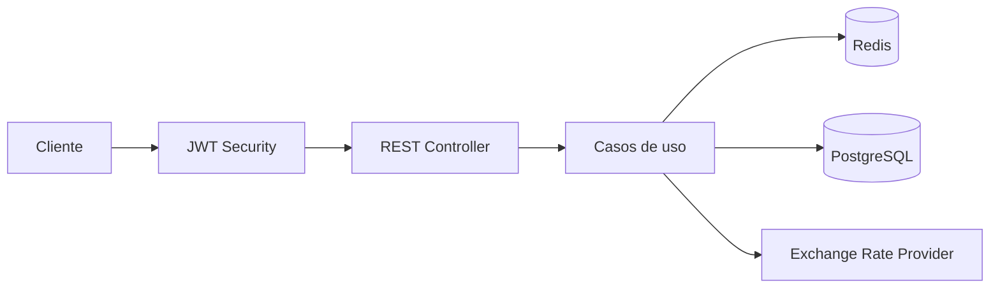

# Products API

API REST desarrollada para gestionar productos y sus precios históricos mediante periodos de vigencia.

La solución parte de los cuatro endpoints obligatorios del challenge y añade una serie de mejoras opcionales: soporte multidivisa, conversión histórica de moneda, caché con Redis y seguridad mediante JWT.

El foco principal del proyecto ha sido mantener las reglas de negocio explícitas, proteger la consistencia de los datos ante concurrencia y construir una solución fácil de ejecutar y validar en local.

## Funcionalidades principales

- Crear productos.
- Añadir precios con un periodo de vigencia.
- Consultar el precio vigente para una fecha concreta.
- Consultar el historial completo de precios de un producto.
- Evitar periodos de precio solapados.
- Devolver errores HTTP con un formato uniforme.
- Exponer documentación OpenAPI, Swagger UI y healthcheck.
- Ejecutar tests unitarios, de integración y end-to-end.
- Ejecutar el benchmark oficial y una prueba de carga complementaria con k6.

## Modelo temporal

Cada precio tiene una fecha inicial obligatoria y una fecha final opcional:

- `initDate` es inclusiva.
- `endDate` también es inclusiva.
- Un `endDate` con valor `null` representa una vigencia indefinida.
- En un intervalo cerrado debe cumplirse `initDate < endDate`.
- Se permiten huecos entre periodos.
- Dos precios no pueden estar vigentes el mismo día.

Por ejemplo:

- `[2024-01-01, 2024-06-30]` se solapa con `[2024-06-30, 2024-12-31]`.
- `[2024-01-01, 2024-06-30]` no se solapa con `[2024-07-01, 2024-12-31]`.

## Stack tecnológico

- Java 21.
- Spring Boot 3.5.15.
- Spring Web.
- Bean Validation.
- Spring Data JPA.
- Spring Security OAuth2 Resource Server.
- Spring Boot Actuator.
- PostgreSQL 17.
- Redis 7.4.
- Flyway.
- SpringDoc OpenAPI 2.8.17.
- Maven Wrapper.
- JUnit 5.
- Mockito.
- Testcontainers.
- Docker y Docker Compose.
- Bash y `curl` para el benchmark oficial.
- Grafana k6 1.7.1 para la prueba de carga complementaria.

Java 21 y Spring Boot considero que dan una base sólida de rendimiento y compatibilidad, además que por mi experiencia en el entorn bancario es un ecosistema maduro para seguridad, validación y generación de OpenAPI/Swagger que aceleran el desarrollo y las pruebas. 
PostgreSQL se eligió por razones de dominio ya que sus tipos de rango y la restricción EXCLUDE permiten garantizar la invariante de no-solapamiento incluso bajo concurrencia, algo que otras BBDD no replican en tests reales. 
Redis aporta una capa de caché para reducir latencias en lecturas frecuentes sin complicar la coherencia de negocio. Finalmente, Flyway y Testcontainers aseguran migraciones reproducibles y suites de integración que validan restricciones reales.
Además la arquitectura hexagonal mantiene el dominio desacoplado de la infraestructura, facilitando pruebas unitarias rápidas y evolución segura.

## Estado de las ramas

Actualmente he integrado la rama "feature/bonus-track" en la rama `master`, que incluye:

- Soporte multidivisa.
- Conversión histórica de moneda.
- Caché con Redis.
- Seguridad JWT.

Las ramas `feature/exchange-currency`, `feature/redis-cache` y `feature/jwt-security` mantienen el historial separado de cada mejora, de este modo
se ha intentado trabajar de forma incremental y documentar los resultados de cada funcionalidad, simulando un caso
real de trabajo en equipo.

## Arquitectura

El proyecto utiliza una arquitectura hexagonal ligera dentro de una única aplicación modular.



La estructura principal se divide en:

- `domain`: modelo de dominio e invariantes implementadas con Java puro.
- `application`: casos de uso, comandos, resultados y puertos.
- `adapter.in.web`: controladores REST, DTO, validaciones, manejo de errores y OpenAPI.
- `adapter.out.persistence`: persistencia JPA, consultas y mapeo entre entidades y dominio.
- Adaptadores adicionales para Redis, seguridad JWT y proveedores externos de cambio de divisa.

El dominio no depende de Spring, JPA ni HTTP. La intención es que las reglas principales puedan probarse sin levantar infraestructura.

Las entidades JPA tampoco salen del adaptador de persistencia. `Product` no mantiene una colección de precios y `PriceJpaEntity` almacena `productId` como un valor escalar, sin relaciones JPA navegables.

Esta decisión evita cargar historiales completos cuando una operación solo necesita un precio concreto y reduce el riesgo de consultas N+1 o cargas accidentales de datos.

## Control de solapamientos

El alta de un precio tiene dos niveles de protección.

### Validación desde la aplicación

Antes de guardar un nuevo periodo, el servicio ejecuta una consulta `EXISTS` para comprobar si ya existe otro precio que se solape.

Esto permite responder de forma controlada con:

```text
409 PRICE_OVERLAP
```

### Garantía desde PostgreSQL

La validación de aplicación mejora la respuesta, pero no es suficiente ante dos escrituras concurrentes.

Por este motivo, PostgreSQL aplica una restricción `EXCLUDE` sobre el producto y su rango de vigencia. La base de datos actúa como última garantía de la invariante.

Aunque la API trabaja con intervalos inclusivos `[initDate, endDate]`, PostgreSQL los representa internamente mediante una columna generada `DATERANGE`:

- `[initDate, endDate + 1)` para periodos cerrados.
- `[initDate, infinity)` cuando `endDate` es `null`.

La migración habilita `btree_gist` y define la exclusión mediante:

- Igualdad de `product_id`.
- Solapamiento del rango `validity`.

Si dos transacciones superan al mismo tiempo la validación previa, PostgreSQL rechaza una de ellas con SQLSTATE `23P01`. El adaptador captura ese caso y lo traduce a `PRICE_OVERLAP`, sin exponer detalles internos de SQL.

## Requisitos previos

Para ejecutar el proyecto mediante Docker Compose se necesita:

- Docker.
- Docker Compose v2.
- Java 21 para generar las claves JWT locales.
- Puertos `8080`, `5432` y `6379` disponibles.

No es necesario instalar PostgreSQL ni Redis de forma local.

## Inicio rápido con Docker Compose

```bash
git clone https://github.com/apiscog/products-mango.git
cd products-mango

java tools/jwt/GenerateDevKeys.java

docker compose up -d --build postgres redis app
docker compose ps
```

Docker Compose levanta PostgreSQL, Redis y la API. La aplicación espera a que las dependencias estén saludables antes de arrancar y Flyway crea el esquema automáticamente.

La imagen de la API se construye mediante un Dockerfile multi-stage.

| Servicio | Dirección |
|---|---|
| API | <http://localhost:8080> |
| Health | <http://localhost:8080/actuator/health> |
| Swagger UI | <http://localhost:8080/swagger-ui/index.html> |
| OpenAPI JSON | <http://localhost:8080/v3/api-docs> |
| PostgreSQL | `localhost:5432` |
| Redis | `localhost:6379` |

Para detener los servicios conservando los volúmenes:

```bash
docker compose down
```

Para eliminar también los datos locales:

```bash
docker compose down -v
```

## Seguridad JWT

La API utiliza Spring Security como OAuth2 Resource Server y valida tokens Bearer firmados con RS256.

La aplicación:

- Valida tokens.
- Comprueba issuer, audience y scopes.
- No emite tokens.
- No gestiona usuarios ni contraseñas.
- No actúa como Authorization Server.

El flujo es el siguiente:

```text
Cliente -> Spring Security / JWT -> Products API -> PostgreSQL
```

### Reglas de acceso

| Acceso | Regla |
|---|---|
| Público | Healthcheck, OpenAPI y Swagger UI |
| Lectura | Scope `products.read` para `GET /products/**` |
| Escritura | Scope `products.write` para `POST /products/**` |

El claim `scope` se convierte en authorities de Spring Security:

```text
products.read  -> SCOPE_products.read
products.write -> SCOPE_products.write
```

El token `writer` utilizado para desarrollo incluye ambos scopes. El permiso de escritura no implica automáticamente permiso de lectura.

La API es stateless y no crea sesiones HTTP. Los errores de seguridad también utilizan respuesta JSON:

- `401 UNAUTHORIZED` para token ausente o inválido.
- `403 FORBIDDEN` para un token válido sin el scope necesario.

### Generación de claves locales

Cada clon genera su propio par de claves RSA para desarrollo:

```text
GenerateDevKeys.java
├── tools/jwt/generated/dev-private-key.pem
└── config/jwt/generated/dev-public-key.pem

GenerateToken.java -> firma con la clave privada
Products API       -> valida con la clave pública
```

Estas claves son únicamente para desarrollo y no deben reutilizarse en producción.

Desde la raíz del proyecto:

```bash
java tools/jwt/GenerateDevKeys.java
docker compose up -d --build postgres redis app
```

En sistemas POSIX, la utilidad intenta limitar los permisos de la clave privada al propietario. En Windows muestra un aviso si no puede aplicar ese modo, pero genera las claves igualmente.

### Generación de tokens

PowerShell:

```powershell
$writerToken = java tools/jwt/GenerateToken.java writer
$readerToken = java tools/jwt/GenerateToken.java reader

$writerToken | Set-Clipboard
```

Linux o macOS:

```bash
writer_token="$(java tools/jwt/GenerateToken.java writer)"
reader_token="$(java tools/jwt/GenerateToken.java reader)"

printf '%s\n' "$writer_token"
```

Los tokens de desarrollo incluyen:

- Issuer `products-challenge-dev`.
- Audience `products-api`.
- Expiración aproximada de 15 minutos.
- Scopes de lectura o escritura según el perfil generado.

En Swagger UI se debe pulsar **Authorize** y pegar únicamente el JWT. Swagger añade automáticamente el prefijo `Bearer`.

### Variables de configuración JWT

| Variable | Valor de desarrollo |
|---|---|
| `JWT_PUBLIC_KEY_LOCATION` | `file:./config/jwt/generated/dev-public-key.pem` |
| `JWT_ISSUER` | `products-challenge-dev` |
| `JWT_AUDIENCE` | `products-api` |
| `JWT_PRIVATE_KEY_LOCATION` | `tools/jwt/generated/dev-private-key.pem` |
| `JWT_TOKEN_TTL_SECONDS` | `900` |

En un entorno productivo, la clave pública debería montarse como secret y la emisión de tokens debería delegarse en un proveedor de identidad.

La clave privada no debe copiarse dentro del contenedor de la API.

### Regenerar las claves

Si falta alguna de las claves, se puede generar de nuevo el par:

```bash
java tools/jwt/GenerateDevKeys.java
```

Si solo existe uno de los archivos, la utilidad falla para evitar dejar un par inconsistente.

Para sustituir ambas claves de forma explícita:

```bash
java tools/jwt/GenerateDevKeys.java --force
```

Los tokens firmados con el par anterior dejarán de ser válidos.

Los detalles de implementación y las pruebas realizadas están documentados en:

[docs/jwt-security-results.md](docs/jwt-security-results.md)

## API

Las fechas utilizan el formato ISO `yyyy-MM-dd`.

| Método | Ruta | Resultado |
|---|---|---|
| `POST` | `/products` | `201 Created` |
| `POST` | `/products/{id}/prices` | `201 Created` |
| `GET` | `/products/{id}/prices?date=YYYY-MM-DD` | `200 OK` |
| `GET` | `/products/{id}/prices` | `200 OK` |

Los siguientes ejemplos están preparados para Bash. En PowerShell se puede utilizar `Invoke-RestMethod`.

### Crear un producto

```bash
curl -i -X POST http://localhost:8080/products \
  -H "Authorization: Bearer $writer_token" \
  -H 'Content-Type: application/json' \
  -d '{
    "name": "Zapatillas deportivas",
    "description": "Modelo 2025 edición limitada"
  }'
```

Respuesta:

```json
{
  "id": 1,
  "name": "Zapatillas deportivas",
  "description": "Modelo 2025 edición limitada"
}
```

La respuesta incluye también:

```text
HTTP/1.1 201 Created
Location: /products/1
```

### Añadir un precio

```bash
curl -i -X POST http://localhost:8080/products/1/prices \
  -H "Authorization: Bearer $writer_token" \
  -H 'Content-Type: application/json' \
  -d '{
    "value": 99.99,
    "initDate": "2024-01-01",
    "endDate": "2024-06-30"
  }'
```

Respuesta:

```json
{
  "value": 99.99,
  "currency": "EUR",
  "initDate": "2024-01-01",
  "endDate": "2024-06-30"
}
```

Un precio sin fecha final se crea enviando `endDate` como `null`:

```bash
curl -i -X POST http://localhost:8080/products/1/prices \
  -H "Authorization: Bearer $writer_token" \
  -H 'Content-Type: application/json' \
  -d '{
    "value": 129.99,
    "initDate": "2024-07-01",
    "endDate": null
  }'
```

### Consultar el precio vigente

```bash
curl \
  -H "Authorization: Bearer $reader_token" \
  'http://localhost:8080/products/1/prices?date=2024-04-15'
```

Respuesta:

```json
{
  "value": 99.99,
  "currency": "EUR"
}
```

### Consultar el historial

```bash
curl \
  -H "Authorization: Bearer $reader_token" \
  http://localhost:8080/products/1/prices
```

Respuesta:

```json
{
  "name": "Zapatillas deportivas",
  "description": "Modelo 2025 edición limitada",
  "prices": [
    {
      "value": 99.99,
      "currency": "EUR",
      "initDate": "2024-01-01",
      "endDate": "2024-06-30"
    },
    {
      "value": 129.99,
      "currency": "EUR",
      "initDate": "2024-07-01",
      "endDate": null
    }
  ]
}
```

Cuando el producto no tiene precios, el historial devuelve:

```json
{
  "prices": []
}
```

## Manejo de errores

Todos los errores controlados siguen una estructura común:

```json
{
  "timestamp": "2026-07-18T12:00:00Z",
  "status": 409,
  "code": "PRICE_OVERLAP",
  "message": "The price period overlaps an existing price",
  "path": "/products/1/prices",
  "violations": []
}
```

| HTTP | Código | Descripción |
|---:|---|---|
| 400 | `VALIDATION_ERROR` | Parámetros o reglas de dominio inválidos |
| 400 | `MALFORMED_REQUEST` | JSON ausente, inválido o con tipos incorrectos |
| 401 | `UNAUTHORIZED` | Token ausente o inválido |
| 403 | `FORBIDDEN` | Token válido sin el scope requerido |
| 404 | `PRODUCT_NOT_FOUND` | El producto no existe |
| 404 | `PRICE_NOT_FOUND` | No existe un precio vigente para la fecha indicada |
| 409 | `PRICE_OVERLAP` | El periodo se solapa con otro precio |
| 500 | `INTERNAL_ERROR` | Error no controlado |

Las respuestas nunca incluyen tokens, claves, stack traces ni detalles internos de base de datos.

Los errores de validación incluyen los campos afectados:

```json
{
  "timestamp": "2026-07-18T12:00:00Z",
  "status": 400,
  "code": "VALIDATION_ERROR",
  "message": "Request validation failed",
  "path": "/products",
  "violations": [
    {
      "field": "name",
      "message": "must not be blank"
    }
  ]
}
```

## Ejecución local sin Docker para la API

También es posible arrancar la aplicación directamente con Maven.

Esta opción requiere:

- Java 21.
- PostgreSQL 17 accesible.
- Redis accesible.
- Clave pública JWT generada.

La configuración predeterminada espera:

| Variable | Valor local |
|---|---|
| `SPRING_DATASOURCE_URL` | `jdbc:postgresql://localhost:5432/products` |
| `SPRING_DATASOURCE_USERNAME` | `products` |
| `SPRING_DATASOURCE_PASSWORD` | `products` |
| `JWT_PUBLIC_KEY_LOCATION` | `file:./config/jwt/generated/dev-public-key.pem` |
| `JWT_ISSUER` | `products-challenge-dev` |
| `JWT_AUDIENCE` | `products-api` |

Windows:

```powershell
.\mvnw.cmd spring-boot:run
```

Linux o macOS:

```bash
./mvnw spring-boot:run
```

Flyway se ejecuta durante el arranque.

Para evaluar el proyecto, Docker Compose sigue siendo la opción recomendada porque fija las versiones de PostgreSQL y Redis y evita diferencias de configuración entre entornos.

## Tests

### Tests rápidos

Windows:

```powershell
.\mvnw.cmd test
```

Linux o macOS:

```bash
./mvnw test
```

Esta suite cubre principalmente:

- Dominio.
- Casos de uso.
- Validaciones.
- Controladores WebMvc.
- Seguridad.
- Generación local de claves.

No levanta PostgreSQL, Redis, Docker Compose ni la aplicación completa.

### Suite completa

Windows:

```powershell
.\mvnw.cmd verify
```

Linux o macOS:

```bash
./mvnw verify
```

Además de los tests rápidos, Maven Failsafe ejecuta los tests `*IT`.

La suite de integración utiliza infraestructura real mediante Testcontainers:

- PostgreSQL.
- Redis.
- Flyway.
- JWT real.
- Peticiones HTTP end-to-end.
- Restricción de exclusión.
- Casos de concurrencia.

No se utiliza H2 para sustituir PostgreSQL.

Totales actuales:

- 124 tests rápidos.
- 63 ejecuciones de integración.
- 187 ejecuciones en total.

Estos números se incluyen como referencia y pueden aumentar a medida que evolucione la suite.

## Rendimiento

El repositorio incluye dos herramientas distintas. No se presentan como equivalentes porque miden el sistema de forma diferente.

### Benchmark oficial

El archivo `performance/benchmark.sh` es el script original proporcionado con el challenge y se conserva sin modificaciones.

El escenario ejecuta:

1. Healthcheck.
2. Creación de un producto inicial.
3. Creación de un precio.
4. Creación de 1.000 productos.
5. Ejecución de 20.000 consultas de precio vigente.
6. Ejecución de 15.000 consultas de historial.

Las peticiones se lanzan con procesos `curl` en background. Este benchmark no utiliza VUs, thresholds ni percentiles.

Se puede ejecutar mediante:

```bash
bash performance/run-benchmark.sh
```

El script original utiliza la URL fija:

```text
http://product-api:8080
```

También fue diseñado para una versión sin autenticación. Por ese motivo, los resultados oficiales publicados se obtuvieron sobre el commit base compatible con el challenge y no sobre la rama integrada con JWT.

Los resultados se encuentran en:

[docs/performance-results.md](docs/performance-results.md)

### Prueba de carga con k6

`performance/products-load-test.js` es una prueba complementaria desarrollada para medir el comportamiento con concurrencia controlada.

Mantiene las cantidades principales del escenario, pero añade:

- VUs configurables.
- Checks funcionales.
- Thresholds.
- Métricas p50, p95 y p99.
- Autenticación mediante JWT.

Para ejecutarla:

```bash
export ACCESS_TOKEN="$(java tools/jwt/GenerateToken.java writer)"

docker compose --profile benchmark up \
  --build \
  --abort-on-container-exit \
  --exit-code-from k6
```

PowerShell:

```powershell
$env:ACCESS_TOKEN = java tools/jwt/GenerateToken.java writer

docker compose --profile benchmark up `
  --build `
  --abort-on-container-exit `
  --exit-code-from k6
```

Variables opcionales:

- `BASE_URL`.
- `PRODUCT_CREATION_VUS`.
- `PRICE_QUERY_VUS`.
- `HISTORY_QUERY_VUS`.

Cambiar los VUs modifica la concurrencia, pero no el número total de iteraciones.

Los resultados del benchmark Bash y los de k6 se mantienen separados para no mezclar metodologías.

Documentación relacionada:

- [docs/performance-results.md](docs/performance-results.md)
- [docs/jwt-security-results.md](docs/jwt-security-results.md)
- [docs/redis-cache-results.md](docs/redis-cache-results.md)

## Decisiones técnicas

### Java 21 y Spring Boot 3.5

Java 21 es una versión LTS y Spring Boot 3.5 ofrece una base estable y compatible con las librerías utilizadas en el proyecto.

### PostgreSQL como base real

Las reglas temporales dependen de rangos, índices y restricciones específicas de PostgreSQL. Por ese motivo, los tests de integración utilizan PostgreSQL real mediante Testcontainers en lugar de una base embebida.

### Flyway y validación del esquema

El esquema se versiona mediante migraciones Flyway.

Hibernate utiliza `ddl-auto=validate`, de modo que valida el modelo, pero no crea ni modifica tablas de forma implícita.

### `BigDecimal` para importes

Los precios se representan con `BigDecimal` y se almacenan como `NUMERIC(19,2)`.

La API rechaza importes con más de dos decimales y evita redondeos silenciosos.

### `LocalDate` para vigencias

La vigencia se expresa en días completos, sin hora ni zona horaria. Por eso se utiliza `LocalDate` en lugar de `LocalDateTime` o `Instant`.

### Arquitectura hexagonal ligera

La separación entre dominio, aplicación y adaptadores permite probar el negocio de forma aislada y mantener desacopladas las dependencias externas.

Se ha evitado añadir interfaces o capas sin una responsabilidad clara.

### Persistencia sin relaciones navegables

Las operaciones trabajan con identificadores y consultas específicas en lugar de navegar grafos de entidades JPA.

Esto mantiene las consultas previsibles y evita cargar datos que no se necesitan.

### Restricción de exclusión

La comprobación desde Java permite responder antes, pero PostgreSQL mantiene la garantía final ante concurrencia.

La invariante no depende únicamente de que dos transacciones se ejecuten de forma secuencial.

### Tests con infraestructura real

Testcontainers permite validar migraciones, restricciones, Redis y comportamiento HTTP utilizando servicios equivalentes a los de ejecución.

### Optimización basada en medidas

No se han modificado pools de conexiones, parámetros de JVM o índices sin una necesidad observada.

Las optimizaciones introducidas están justificadas por el modelo de acceso o por mediciones reproducibles.

## Estructura del proyecto

```text
src/main/java/com/mango/products
├── domain
│   └── Modelo e invariantes de negocio
├── application
│   └── Casos de uso, comandos, resultados y puertos
└── adapter
    ├── in/web
    │   └── REST, DTO, validación, errores y OpenAPI
    └── out
        ├── persistence
        │   └── JPA, mappers, repositorios y PostgreSQL
        ├── cache
        │   └── Redis
        └── exchange
            └── Proveedores de cambio de divisa

src/main/resources
└── db/migration
    └── Migraciones Flyway

src/test
└── Tests unitarios, integración y end-to-end

performance
├── benchmark.sh
├── run-benchmark.sh
├── products-load-test.js
└── run-k6-load-test.sh

docs
└── Resultados y decisiones técnicas
```

## Bonus: soporte multidivisa

Cada precio almacena su valor y moneda original.

Las monedas soportadas son:

- `EUR`.
- `USD`.
- `GBP`.
- `JPY`.
- `CHF`.

Si `currency` no se envía o tiene valor `null`, la API utiliza `EUR` para mantener compatibilidad con el contrato original.

Los códigos se aceptan sin distinguir mayúsculas y minúsculas, pero se almacenan normalizados en mayúsculas.

Ejemplo:

```bash
curl -X POST http://localhost:8080/products/1/prices \
  -H "Authorization: Bearer $writer_token" \
  -H 'Content-Type: application/json' \
  -d '{
    "value": 99.99,
    "currency": "EUR",
    "initDate": "2024-01-01",
    "endDate": "2024-06-30"
  }'
```

La consulta sin conversión devuelve el valor original almacenado:

```bash
curl \
  -H "Authorization: Bearer $reader_token" \
  'http://localhost:8080/products/1/prices?date=2024-04-15'
```

```json
{
  "value": 99.99,
  "currency": "EUR"
}
```

## Conversión histórica de moneda

La conversión es opcional y solo está disponible al consultar el precio vigente.

```bash
curl \
  -H "Authorization: Bearer $reader_token" \
  'http://localhost:8080/products/1/prices?date=2024-04-15&currency=USD'
```

Respuesta:

```json
{
  "value": 106.74,
  "currency": "USD",
  "originalValue": 99.99,
  "originalCurrency": "EUR",
  "exchangeRate": 1.0675,
  "exchangeRateDate": "2024-04-15"
}
```

La fecha de la tasa coincide con la fecha utilizada para localizar el precio vigente.

La conversión:

- Utiliza `BigDecimal`.
- No redondea la tasa.
- Redondea únicamente el importe final.
- Utiliza dos decimales y `RoundingMode.HALF_UP`.
- No se persiste.
- No modifica el historial original.

Como simplificación del challenge, JPY también se devuelve con dos decimales.

El puerto `ExchangeRateProvider` desacopla la lógica de aplicación del proveedor HTTP.

El adaptador consulta primero el proveedor principal y utiliza un fallback ante:

- Timeout.
- Error de red.
- Respuesta 5xx.
- Histórico no encontrado.
- Respuesta inválida.

La respuesta solo se acepta si la fecha recibida coincide con la fecha solicitada.

Timeouts predeterminados:

- Conexión: 2 segundos.
- Lectura: 3 segundos.

Variables disponibles:

- `EXCHANGE_API_PRIMARY_URL`.
- `EXCHANGE_API_FALLBACK_URL`.
- `EXCHANGE_API_CONNECT_TIMEOUT`.
- `EXCHANGE_API_READ_TIMEOUT`.

Las plantillas de URL deben incluir `{date}` y `{base}`.

Si ambos proveedores fallan, la API responde:

```text
503 SERVICE_UNAVAILABLE
```

No se exponen URLs, cuerpos externos ni detalles de infraestructura.

Cuando la moneda origen y destino coinciden, se utiliza una tasa `1` y no se realiza ninguna petición externa.

Flyway V2 añade la columna `prices.currency`, migra los registros existentes a `EUR` y aplica las restricciones correspondientes.

La moneda no forma parte de la restricción de solapamiento. Dos precios del mismo producto no pueden compartir periodo aunque utilicen monedas distintas.

Más detalles:

- [docs/exchange-currency-results.md](docs/exchange-currency-results.md)
- [docs/bonus-track-results.md](docs/bonus-track-results.md)

## Limitaciones y posibles mejoras

La rama actual cubre los cuatro endpoints obligatorios e integra multidivisa, conversión histórica, Redis y JWT.

No incluye:

- Gestión de usuarios.
- Emisión o revocación inmediata de tokens.
- Paginación.
- Actualización de precios.
- Eliminación de precios.
- Conversión del historial.
- Criptomonedas.
- Reglas de decimales específicas por divisa.
- SLA sobre el proveedor gratuito de cambio.

En una evolución del sistema tendría sentido valorar:

- Integración con un proveedor de identidad real.
- Rotación de claves.
- Paginación del historial.
- Caché de tasas de cambio.
- Observabilidad y alertas.
- Pipeline CI/CD.
- Despliegue cloud.
- API Gateway si el sistema creciera hacia varios servicios.

Estas mejoras quedan fuera del alcance del challenge y no se presentan como funcionalidades implementadas.

## Comandos útiles

| Objetivo | Comando |
|---|---|
| Generar claves JWT | `java tools/jwt/GenerateDevKeys.java` |
| Levantar API, PostgreSQL y Redis | `docker compose up -d --build postgres redis app` |
| Ver estado de los servicios | `docker compose ps` |
| Ver logs de la API | `docker compose logs app` |
| Detener conservando datos | `docker compose down` |
| Detener y eliminar datos | `docker compose down -v` |
| Ejecutar tests rápidos en Windows | `.\mvnw.cmd test` |
| Ejecutar suite completa en Windows | `.\mvnw.cmd verify` |
| Generar token writer en PowerShell | `$env:ACCESS_TOKEN = java tools/jwt/GenerateToken.java writer` |
| Ejecutar benchmark oficial | `bash performance/run-benchmark.sh` |
| Ejecutar carga k6 | `docker compose --profile benchmark up --build --abort-on-container-exit --exit-code-from k6` 